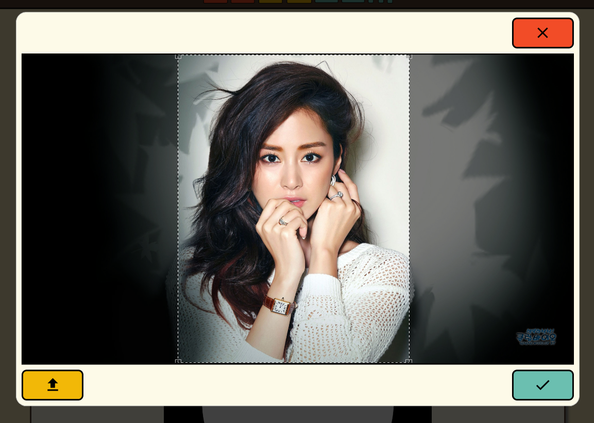
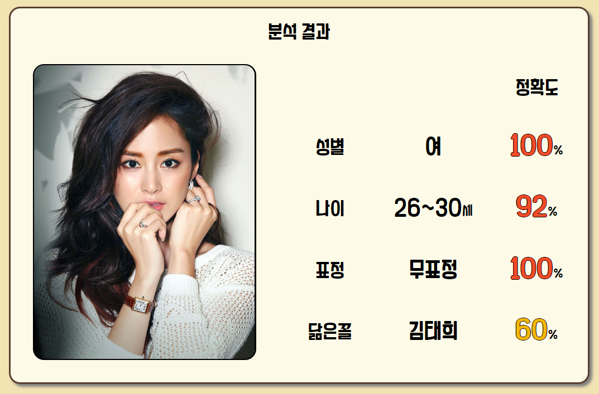

[여기](https://human-face-report.herokuapp.com/)에서 이용하실수 있습니다.

## 설명

분석하고자 하는 얼굴 이미지를 애플리케이션을 통해 첨부, 제출해주세요!

인간안면분석기가 해당 이미지의 닮은꼴 유명인, 나이, 성별, 표정을 정확도와 함께 보고서 형태로 제출해줄 겁니다!

## 유의사항

- Clova API 자체의 제한에 의해, 일일 API 호출 허용량은 1000건입니다. 따라서 경우에 따라 웹의 동작이 불가능할 수 있습니다.
- Heroku 무료 배포 서버 특성 상, 주기적으로 sleeptime에 들어가게 되므로, 여기서 다시 깨어나는 데에 일정시간이 소요될 수 있습니다.

## 프로젝트 스택

프로젝트에 사용된 코어 라이브러리 정보입니다.

- React
- Redux + Redux-Thunk
- ExpressJS
- JavaScript (for Server)
- TypeScript (for Client)
- Styled-Components
- Axios
